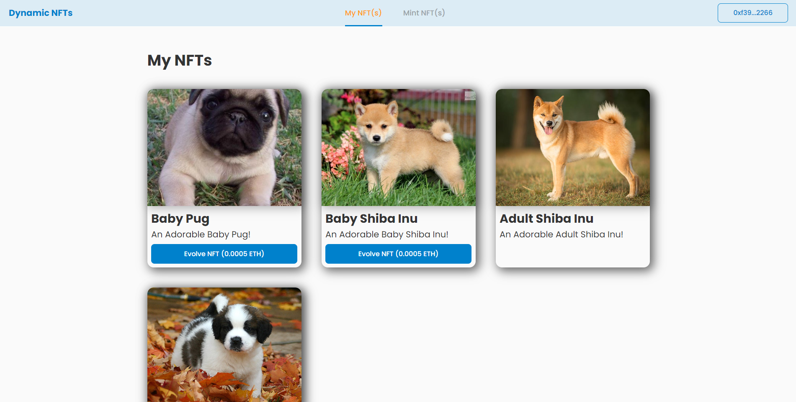

<p align="center">
   
</p>

# Dynamic NFTs

> This project aims to create a decentralized NFT platform where users can mint one of the three available NFTs and evolve their NFTs.

---

<p align="center"></p>
<p align="center"></p>

---

# :pushpin: Table of Contents

- [Features](#link-features)
- [Dependencies](#lock-dependencies)
- [Getting Started](#checkered_flag-getting-started)
- [Testing](#bug-testing)
- [FAQ](#postbox-faq)
- [Useful commands](#eyes) 

# :link: Features

- Mint new NFTs for 0.001 ETH
- Evolve their NFTs for 0.0005 ETH

# :lock: Dependencies

**To run this script you need to install locally on your machine the following dependencies:**

- [NodeJS](https://nodejs.org/en/download/)

# :checkered_flag: Getting Started

Clone the project via HTTPS by running this command:

`git clone https://github.com/tiago-web/Dynamic_NFTs.git`

SSH URLs provide access to a Git repository via SSH, a secure protocol. If you have a SSH key registered in your Github account, clone the project using this command:

`git clone git@github.com:tiago-web/Dynamic_NFTs.git`

Run the following command in order to install the dependencies and start the whole application in a development environment:

**Smart contracts set up:**

`cd smart-contracts`

Then:

```bash
# make a copy of environment variables
$ cp .env.example .env

# edit .env with an editor, eg vim
$ vim .env

# add to environment and edit values to reflect local configuration environment
$ source .env

$ yarn && yarn deploy:local
# or
$ npm i && npm run deploy:local
```

If the project runs successfully you should a local chain running on:

*RPC:* `http://localhost:8545`
*Chain ID:* `1337`

**Frontend set up:**

`cd frontend`

Then:

```bash
# make a copy of environment variables
$ cp .env.example .env

# edit .env with an editor, eg vim
$ vim .env

# add to environment and edit values to reflect local configuration environment
$ source .env

$ yarn && yarn start
# or
$ npm i && npm run start
```

If the project runs successfully you should be able to access it on:

`http://127.0.0.1:5173/`

# :bug: Testing

In order to test the application, you should run the following command:

**Smart contracts**

`cd smart-contracts`

Then:

`yarn test` or `npm run test`

# :eyes: Useful commands

```sh
# To generate contract types
yarn typechain

# to generate all the deployed address TS file and abis
yarn hardhat files-writer --network <neworkName>

# to mint a new Digital NFT
yarn hardhat mint-nft --dog-type <dogType> --network <neworkName>

# to evolve a specific Digital NFT
yarn hardhat evolve-nft --token-id <tokenId> --network <neworkName>
```

# :postbox: FAQ

**Question:** What are the technologies used in this project?

**Answer:** The tecnologies used in this project are:

- [React](https://reactjs.org/)
- [TypeScript](https://www.typescriptlang.org/)
- [Solidity](https://soliditylang.org/)
- [Hardhat](https://hardhat.org/)
- [Chai](https://www.chaijs.com/)
- [IPFs](https://ipfs.tech/)
